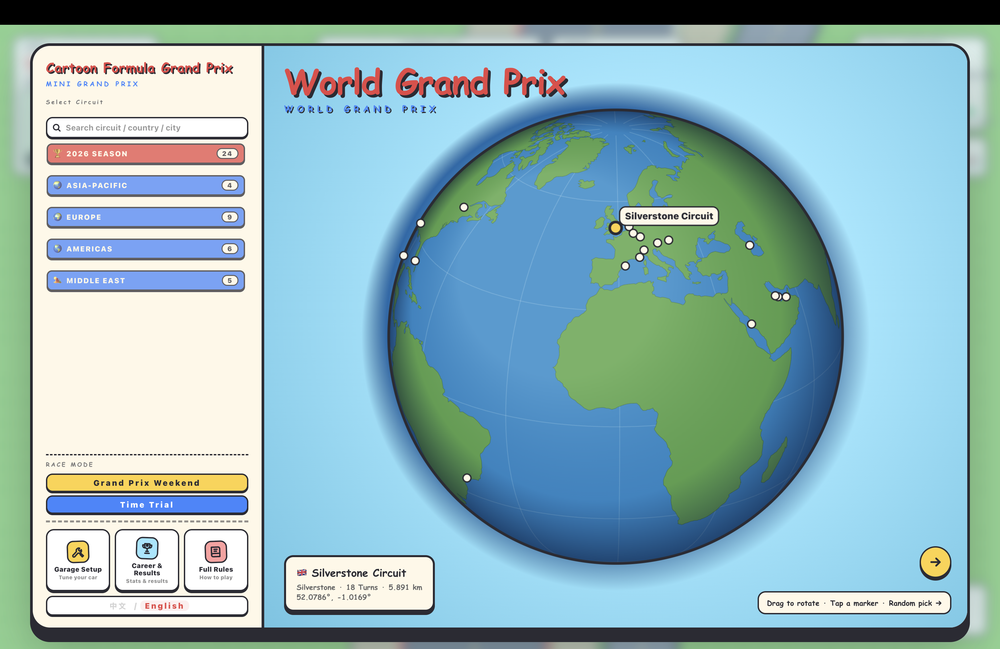
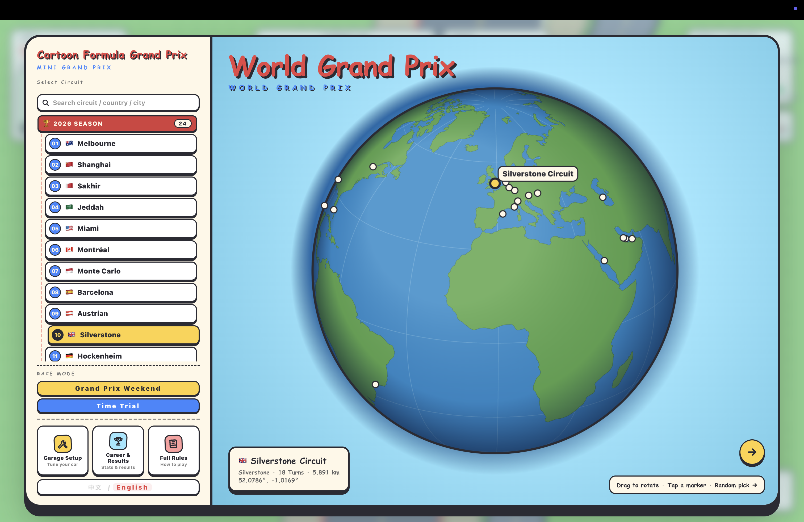
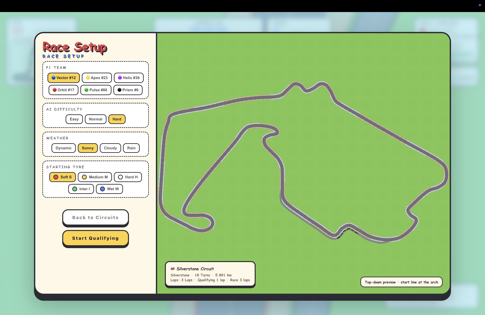
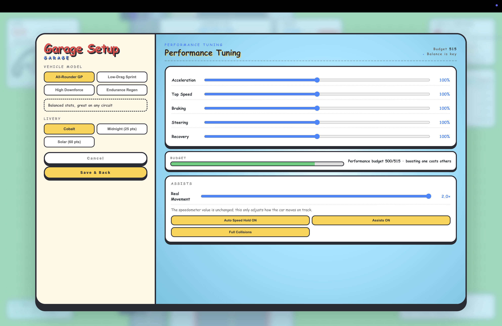
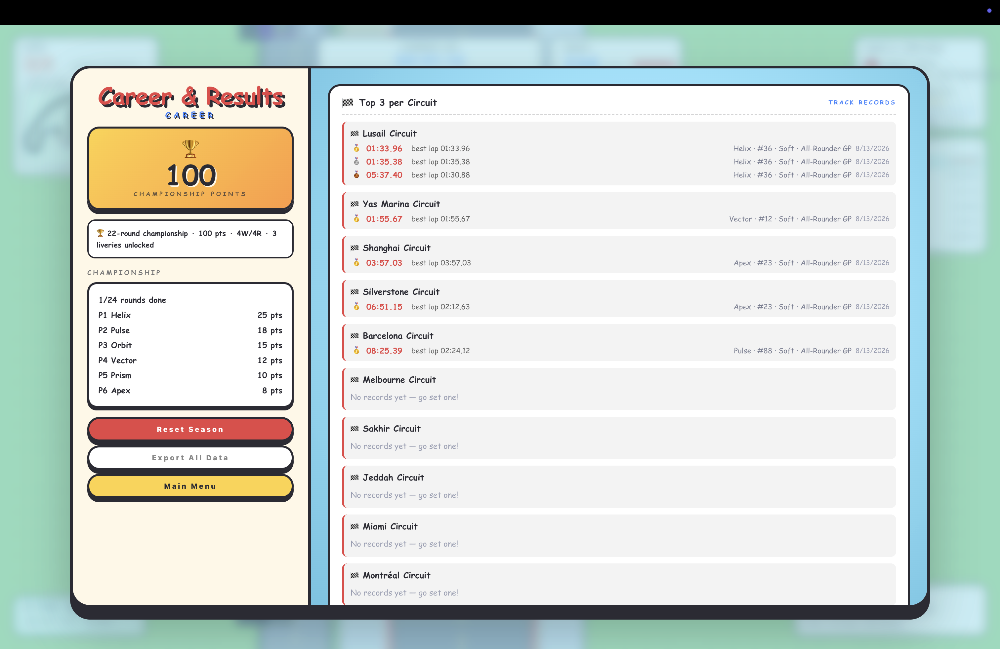
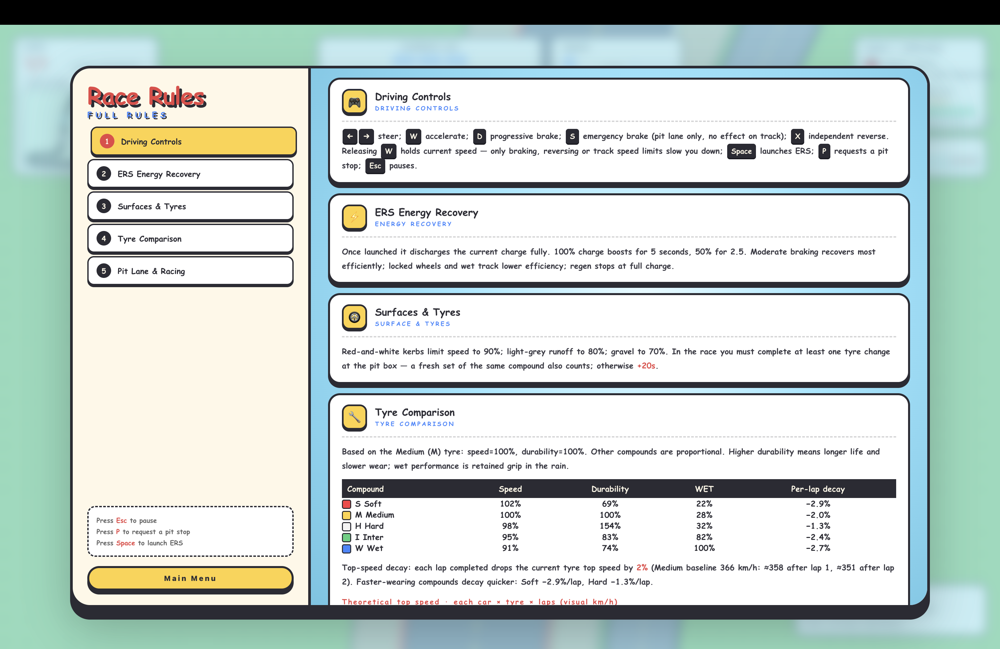
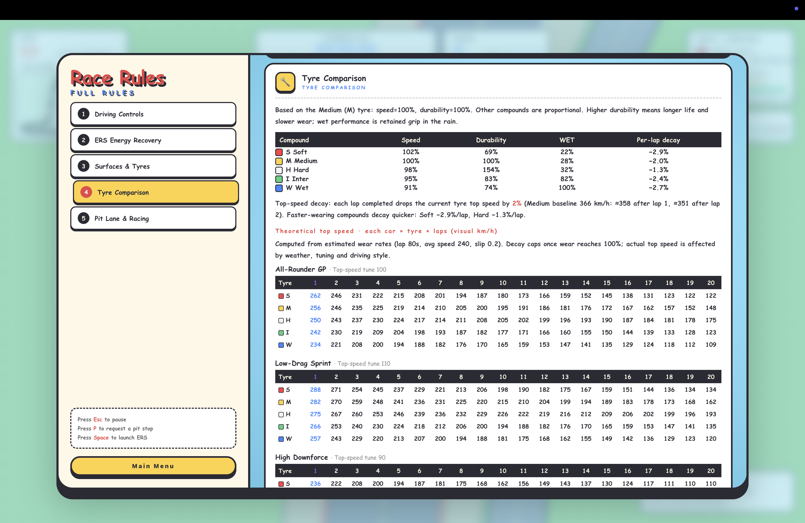
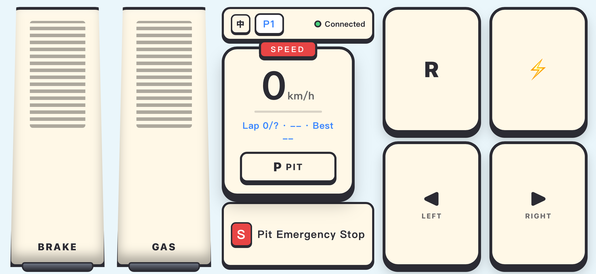

<div align="center">

# 🏁 Mini Grand Prix

### A cartoon formula racing weekend in your browser

**Qualify. Race. Adapt. Win.**

A strategy racing game built with native HTML, JavaScript, and Canvas 2D.<br>
No game engine, no frontend framework, no build step—just driving, tyres, weather, ERS, and pit strategy.

**English** · [简体中文](README_CN.md)

<p align="center">
  <a href="LICENSE"></a>
  
  <br>
  
  
</p>

<p align="center">
  <a href="https://xhhdaxx.github.io/Mini-Grand-Prix/"></a>
  <br>
  <sub>No install, no signup — open the link and race. Keyboard mode runs in the browser; phone-controller mode still needs <code>npm run start:gamepad</code> locally.</sub>
</p>

<a href="https://xhhdaxx.github.io/Mini-Grand-Prix/showcase/gameplay.html"></a>

If you enjoy racing games that are easy to pick up but make every lap a decision, consider leaving a **Star ⭐**.

[Quick Start](#-quick-start) · [Features](#-features) · [Controls](#-controls) · [Architecture](#-technical-overview) · [Contributing](#-contributing)

</div>

---

## 🎮 A complete miniature race weekend

> **Pick a circuit on the 3D globe → Tune the car → One-lap qualifying → Three-lap race → Points and the next round**

Mini Grand Prix compresses the best parts of formula racing into a compact browser session. You race five AI cars while managing tyres, ERS, changing weather, and your pit window. Raw speed matters, but the next corner, the next rain cloud, and the next pit call often decide where you finish.

Alongside the full Grand Prix weekend, you can run a solo time trial. In gamepad mode, two players can also connect their own phones for qualifying and a split-screen head-to-head race.

## 🔥 Features

| On track | In the cockpit | On the pit wall |
|:---|:---|:---|
| 🏎️ **Six-car racing**: battle five AI opponents for position | ⚡ **ERS management**: deploy, harvest under braking, and manage cooldown | 🌦️ **Dynamic weather**: read the forecast and time the tyre change |
| 🌍 **24 circuit interpretations**: choose a round on a draggable 3D globe | 🛞 **Tyre model**: compound, temperature, wear, and wet-weather suitability | 🔧 **Dedicated pit lanes**: entry, exit, team boxes, speed limit, and safe release |
| 🏁 **Qualifying + race**: one lap sets the grid; three laps settle the result | 💨 **Readable physics**: lock-ups, collisions, reversing, and surface speed limits | 📡 **Race control**: yellow flags, penalties, track limits, and live classification |
| 🏆 **24-round career**: points, wins, past champions, and local leaderboards | 🎛️ **Performance tuning**: four presets plus budget-limited custom setup | 📱 **Phone controllers**: join over LAN and race head-to-head in split screen |
| 🌐 **Bilingual UI**: switch between English and Simplified Chinese in-game | 📦 **Build-free frontend**: the browser loads native ES Modules directly | 💾 **Local saves**: results, setup, and season progress stay in your browser |

<details>
<summary><strong>More race detail</strong></summary>

- Soft, Medium, Hard, Intermediate, and Wet tyre compounds
- Clear, overcast, rainy, and forecastable dynamic weather
- A mandatory race pit stop; skipping the tyre change adds a 20-second penalty
- Configurable AI difficulty, weather, starting tyres, team, and car setup
- Jump starts, overtaking under yellow, collision responsibility, and cumulative track-limit penalties
- HUD for speed, gear, RPM, lap times, tyres, weather, ERS, position, circuit map, and pit guidance
- Fault-tolerant local storage for best results, recent races, vehicle setup, and season progress

</details>

## 🖼️ Screenshots

| 3D globe and circuit selection | Race setup and circuit preview |
|:---:|:---:|
|  |  |
| **Car setup** | **Career and results** |
|  |  |

<details>
<summary><strong>See the full rules screens and phone controller</strong></summary>

<p align="center">
  
  
</p>



</details>

### Circuit footage

GIF previews loop automatically; click one to watch the full clip. Both previews and videos are hosted as [GitHub Release](https://github.com/xhhdaxx/Mini-Grand-Prix/releases/tag/gameplay-v1) assets, keeping them out of repository clones.

| Race Start (Shanghai) | Cornering (Miami) |
|:---:|:---:|
| <a href="https://github.com/xhhdaxx/Mini-Grand-Prix/releases/download/gameplay-v1/shanghai-gameplay.mp4"></a> | <a href="https://github.com/xhhdaxx/Mini-Grand-Prix/releases/download/gameplay-v1/miami-gameplay.mp4"></a> |
| **ERS Acceleration (Austria)** | **Tyre Change (Barcelona)** |
| <a href="https://github.com/xhhdaxx/Mini-Grand-Prix/releases/download/gameplay-v1/austria-gameplay.mp4"></a> | <a href="https://github.com/xhhdaxx/Mini-Grand-Prix/releases/download/gameplay-v1/barcelona-gameplay.mp4"></a> |
| **AI Battle 1 (Lusail)** | **AI Battle 2 (Yas Marina)** |
| <a href="https://github.com/xhhdaxx/Mini-Grand-Prix/releases/download/gameplay-v1/lusail-gameplay.mp4"></a> | <a href="https://github.com/xhhdaxx/Mini-Grand-Prix/releases/download/gameplay-v1/yas-marina-gameplay.mp4"></a> |

## 🧠 Every lap is a decision

- **Deploy now or save it?** ERS lasts only a few seconds before it needs brake harvesting and cooldown.
- **Pit before the rain arrives?** The forecast gives you information; track position and tyre condition determine the answer.
- **Stretch the stint or protect the rubber?** Temperature and wear directly affect grip and performance.
- **Be quick—and stay clean.** Yellow flags, track limits, collision responsibility, and the mandatory tyre change can all reshape the result.

## 🌍 24 rounds, 6 fictional teams

<details>
<summary><strong>Expand the 2026 calendar</strong></summary>

Australia, Shanghai, Bahrain, Saudi Arabia, Miami, Canada, Monaco, Spain, Austria, Great Britain, Germany, Belgium, Hungary, the Netherlands, Italy, Azerbaijan, Malaysia, Singapore, Austin, Mexico, Brazil, Las Vegas, Qatar, and Abu Dhabi.

> Circuits are hand-built, **simplified artistic interpretations** inspired by real-world geography—not survey-accurate reproductions. Corner counts, radii, lengths, and layouts differ from their real-world counterparts.

</details>

| Team | Number | Character |
|:---|:---:|:---|
| Vector Cobalt | 12 | Balanced and approachable |
| Apex Saffron | 23 | Straight-line speed |
| Helix Indigo | 36 | Cornering performance |
| Orbit Vermilion | 17 | ERS recovery |
| Pulse Teal | 88 | All-round power |
| Prism Onyx | 6 | Stability |

All team identities, car numbers, and liveries are fictional. Performance differences are deliberately limited and fair, and AI cars share the same underlying systems as the player.

## 🚀 Quick start

### Requirements

- Node.js 18+
- A modern desktop browser: Chrome, Edge, Firefox, or Safari
- For phone controllers, the computer and phones must share a local network

### Install and run

```bash
npm install

# Keyboard-only mode
npm run start:keyboard

# Keyboard + phone controller mode (WebSocket, QR codes, and head-to-head)
npm run start:gamepad
```

Open <http://localhost:8080/> on the computer.

> [!IMPORTANT]
> Do not open `index.html` directly. Browsers commonly block ES Modules on `file://` pages, so start the local HTTP server first.

### Connect phone controllers

1. Put the computer and phones on the same Wi-Fi network, or connect the computer to a phone hotspot.
2. Run `npm run start:gamepad`.
3. Scan the P1 / P2 QR code shown by the desktop game, or open one of the LAN addresses printed in the terminal.
4. Use the P1 controller for single-player modes; connect P1 and P2 separately for head-to-head.

P1 can always fall back to the keyboard. Keyboard-only mode does not expose the WebSocket service, QR codes, or head-to-head entry point.

## 🎮 Controls

| Key | Action | Key | Action |
|:---:|:---|:---:|:---|
| `W` | Accelerate | `D` | Brake |
| `←` / `→` | Steer | `X` | Reverse |
| `Space` | Deploy ERS | `P` | Request / cancel pit stop |
| `1`–`5` | Select the next pit tyre | `S` | Emergency stop in your team box |
| `Esc` | Pause | `R` | Restart after the results screen |

**Auto speed hold** is enabled by default: releasing `W` maintains the current speed. You can disable it in Car Setup. Braking, reversing, and surface limits still slow the car.

## 🧰 Technical overview

```text
Browser-native ES Modules
├── Canvas 2D         Circuits, cars, scenery, and HUD
├── localStorage      Results, career, setup, and season progress
└── Node.js + ws      Local static server and optional phone controllers
```

The game frontend has no external runtime library. The browser loads the source directly, with no compilation or bundling.

<details>
<summary><strong>Expand the project structure</strong></summary>

```text
index.html                       Page entry point and UI styles
gamepad.html                     Phone controller page
src/main.js                      Game loop and flow orchestration
src/i18n.js                      English and Chinese UI strings
src/game/                        Cars, AI, circuits, race, and strategy systems
src/renderer/                    Circuit, car, scenery, and HUD rendering
src/ui/                          Menus and 3D globe selection
src/utils/                       Input, maths, storage, and export helpers
src/gamepad/                     Phone controller WebSocket client
server.js                        Local server and WebSocket relay
tests/run.js                     Node.js functional test entry point
tests/smoke.mjs                  Playwright browser smoke test
docs/prd.md                      Product requirements and acceptance scope
docs/track-authoring-standard.md Circuit authoring and import standard
docs/pit-lane/README.md          Pit lane system documentation
```

</details>

## ✅ Testing

```bash
npm test          # Cars, races, tyres, ERS, weather, circuits, saves, and localization
npm run lint      # ESLint
npm run smoke     # Playwright browser smoke test
```

When changing rules, physics, circuit geometry, or UI flows, update the relevant tests and documentation with the code.

## 🤝 Contributing

Issues, ideas, and pull requests are welcome. Good places to start include:

- Better AI overtaking, defending, and wet-weather strategy
- Canvas performance, narrow-screen HUD, and accessibility improvements
- New circuit interpretations that follow the geometry standard
- More physics, strategy, save-recovery, localization, and browser-flow tests
- Documentation, translation, and onboarding improvements

Before submitting, follow [AGENTS.md](AGENTS.md) to run the tests applicable to your change and `git diff --check`. Please do not introduce real team names, driver names, official event names, official logos, or other protected visual assets. New images, fonts, audio, data, and code must have clear permission for use.

## 📜 Inspiration and rights notice

The race-weekend structure, calendar, points competition, tyre compounds, ERS, weather, and pit strategy are inspired by real-world single-seater racing and its publicly known sporting concepts. Rules, values, circuits, and flows have been simplified, stylized, and adapted for gameplay. They are not complete reproductions of any official rulebook or real circuit.

> **Mini Grand Prix is an independent, fictional open-wheel racing game. It is not affiliated with, endorsed by, sponsored by, or licensed by Formula 1, the FIA, or any real-world series, team, driver, manufacturer, or circuit operator.**

- All six teams, car numbers, and liveries are fictional.
- All third-party names, trademarks, data, and materials remain the property of their respective owners.
- If you believe repository content infringes your rights, contact the maintainer through Issues with **`[Rights / 侵权联系]`** in the title and include ownership details, relevant links, and a specific description.
- 3D globe land data: [Natural Earth](https://www.naturalearthdata.com/) (Public Domain).
- Phone-controller QR implementation: [Project Nayuki QR Code Generator](https://github.com/nayuki/QR-Code-generator) (MIT).
- Full source, copyright, and license details: [THIRD_PARTY_NOTICES.md](THIRD_PARTY_NOTICES.md).

## ✉️ Contact

For questions, suggestions, collaboration, or rights-related matters, email the author at [xhhdaxx@gmail.com](mailto:xhhdaxx@gmail.com).

## 📄 License

Original source code in this project is released under the [MIT License](LICENSE). Third-party code and data retain their respective licenses and notices.

<div align="center">

**Made with Canvas, curiosity, and a little too much late braking.**

Enjoying the project? **Star ⭐ it, Fork 🍴 it, or share it with another racing fan.**

</div>
