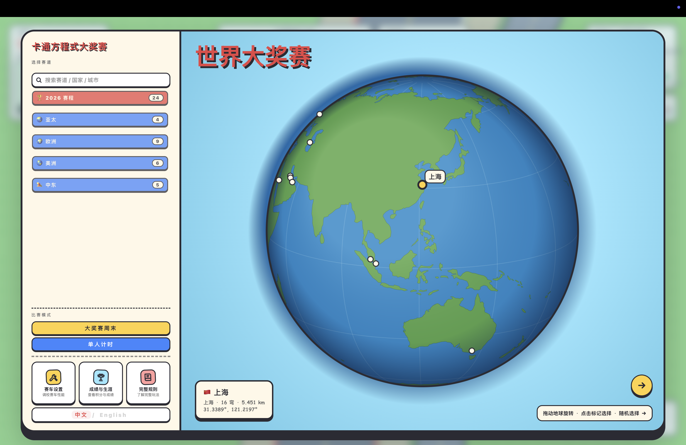
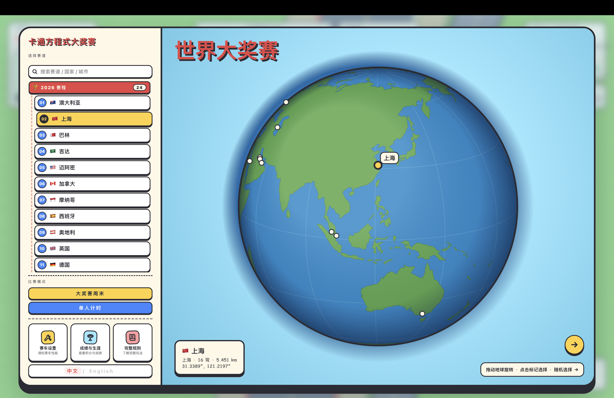
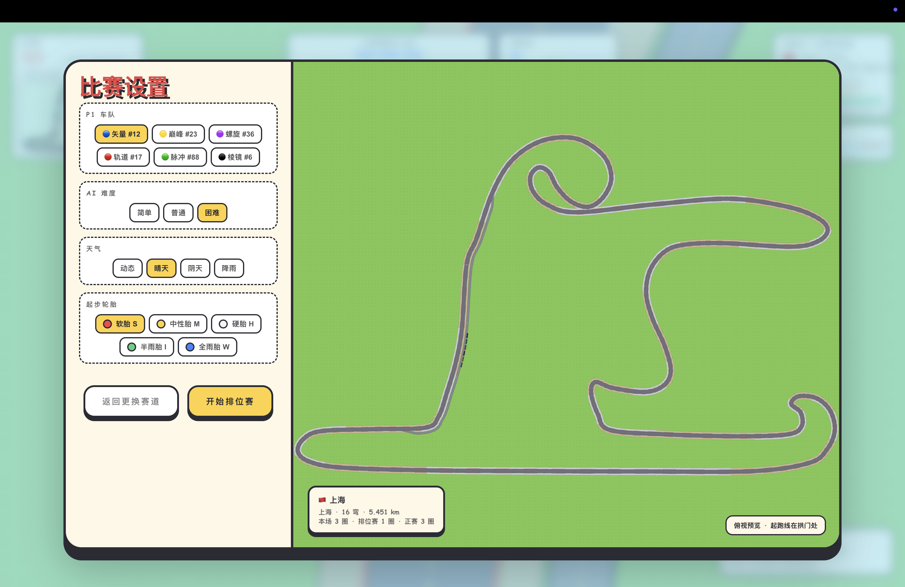
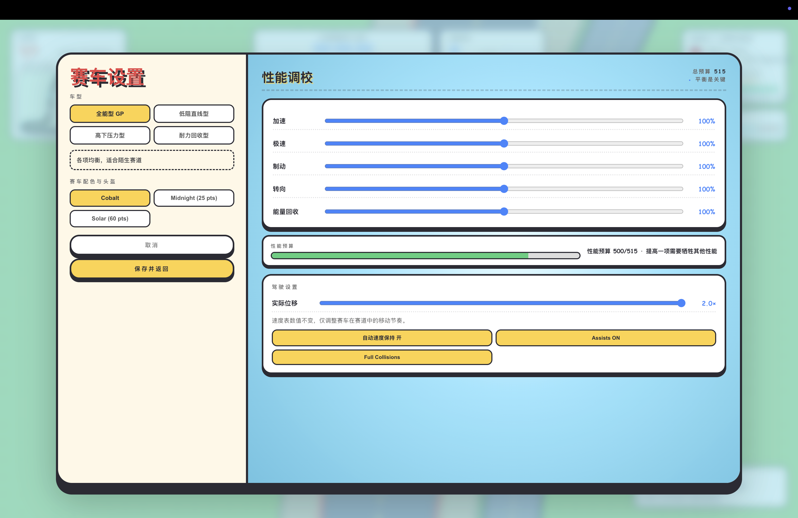
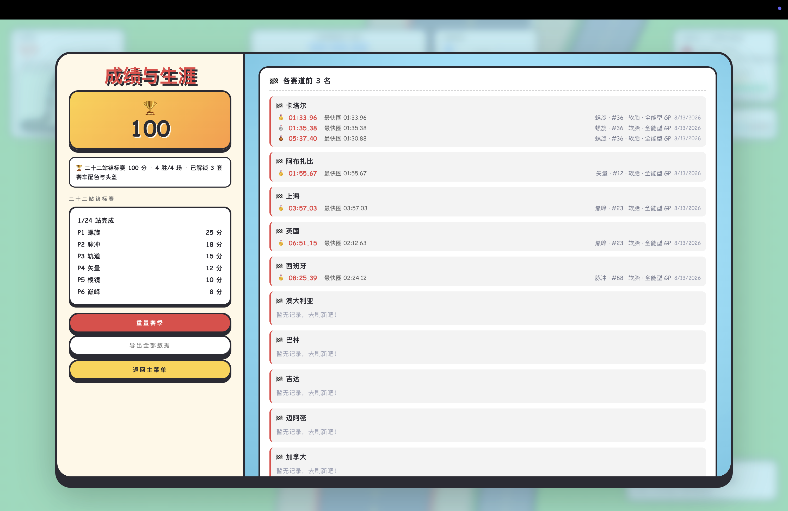
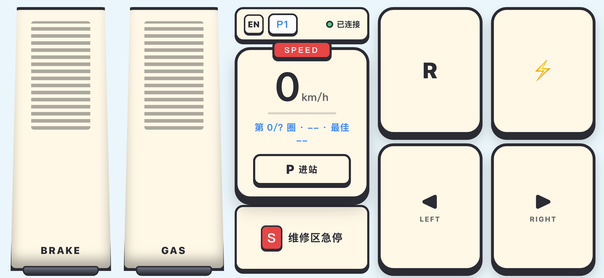
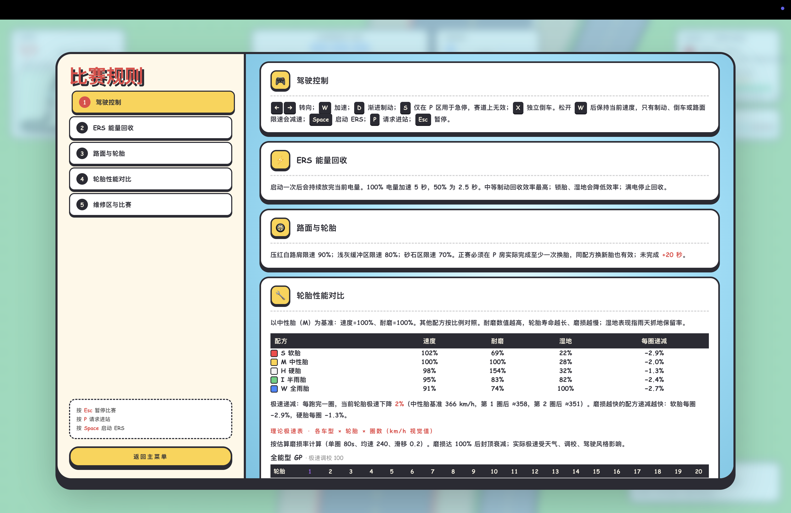
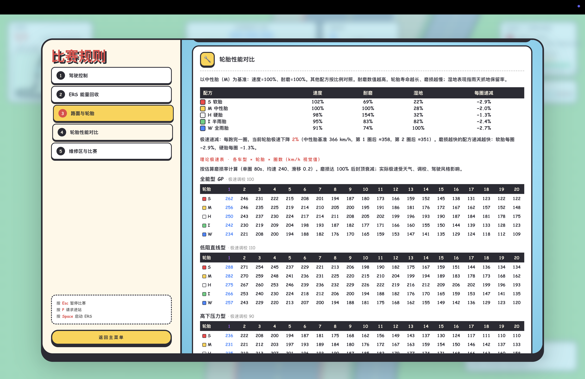

<div align="center">

# 🏁 Mini Grand Prix

### 一台能在浏览器里打开的卡通方程式大奖赛

**排位。竞速。应变。夺冠。**

用原生 HTML、JavaScript 与 Canvas 2D 打造的策略竞速游戏。<br>
没有游戏引擎，没有前端框架，没有构建步骤——只有驾驶、轮胎、天气、ERS 和进站策略。

[English](README.md) · **简体中文**

<p align="center">
  <a href="LICENSE"></a>
  
  <br>
  
  
</p>

<p align="center">
  <a href="https://xhhdaxx.github.io/Mini-Grand-Prix/"></a>
  <br>
  <sub>免安装、免登录，点开链接就能开赛。键盘模式完全可在浏览器运行；手机手柄模式仍需本地执行 <code>npm run start:gamepad</code>。</sub>
</p>

<a href="https://xhhdaxx.github.io/Mini-Grand-Prix/showcase/gameplay.html"></a>

👆 **点击上方图片即可观看真实游戏视频。**

[快速开始](#-快速开始) · [游戏特色](#-游戏特色) · [操作方式](#-操作方式) · [技术实现](#-技术实现) · [参与贡献](#-参与贡献)

</div>

---

## 🎮 一个完整的迷你比赛周末

> **从 3D 地球选择赛道 → 调校赛车 → 一圈排位 → 三圈正赛 → 积分与下一站**

Mini Grand Prix 把方程式赛车最迷人的部分压缩到一次紧凑的浏览器比赛中。你会与 5 辆 AI 赛车同场争夺排名，也要管理轮胎、ERS、天气和进站窗口。速度很重要，但真正决定方格旗落下时排名的，往往是下一个弯、下一片雨云和下一次进站。

除了完整的大奖赛周末，还可以进行单人计时挑战；在手机手柄模式下，两位玩家还能通过各自的手机参加排位与分屏对决。

## 🔥 游戏特色

| 赛道上 | 驾驶舱里 | 策略台上 |
|:---|:---|:---|
| 🏎️ **六车竞速**：玩家与 5 辆 AI 同场争夺排名 | ⚡ **ERS**：主动放电、制动回收与冷却节奏 | 🌦️ **动态天气**：参考预报判断降雨与换胎时机 |
| 🌍 **24 条参考赛道**：从可拖动的 3D 地球上选站 | 🛞 **轮胎模型**：配方、温度、磨损与干湿地适配 | 🔧 **独立维修区**：进出站路线、车队 P 房、限速与安全释放 |
| 🏁 **排位 + 正赛**：一圈定发车位，三圈定胜负 | 💨 **可读物理**：锁胎、碰撞、倒车与不同路面限速 | 📡 **比赛控制**：黄旗、罚时、越界与实时排名 |
| 🏆 **24 站生涯**：积分、胜场、历史冠军与本地排行榜 | 🎛️ **性能调校**：四种预设与受预算约束的自定义设置 | 📱 **手机手柄**：局域网扫码连接，支持双人分屏对决 |
| 🌐 **双语界面**：游戏内随时切换简体中文和英文 | 📦 **零构建前端**：浏览器直接加载原生 ES Module | 💾 **本地存档**：成绩、设置与赛季进度保存在浏览器中 |

<details>
<summary><strong>更多比赛细节</strong></summary>

- 软胎、中性胎、硬胎、半雨胎和全雨胎五种配方
- 晴天、阴天、降雨和可提前预判的动态天气
- 正赛强制进站换胎，未完成则在完赛后加罚 20 秒
- 可调 AI 难度、天气、起步轮胎、车队和赛车设置
- 抢跑、黄旗下超车、碰撞责任和累计越界处罚
- 速度、挡位、转速、圈速、轮胎、天气、ERS、排名、赛道图和进站引导 HUD
- 最快成绩、最近比赛、车辆设置和赛季进度均在本地容错保存

</details>

## 🖼️ 游戏画面

| 3D 地球选站 | 比赛设置与赛道预览 |
|:---:|:---:|
|  |  |
| **赛车调校** | **成绩与生涯** |
|  |  |

### 📱 手机手柄

手机扫码即可变成无线手柄 —— 局域网连接、零延迟操控，两位玩家还能通过各自的手机参加排位与分屏对决。P1 始终可以使用键盘作为后备输入。

<p align="center">
  
</p>

<details>
<summary><strong>查看完整规则界面</strong></summary>

<p align="center">
  
  
</p>

</details>

### 赛道实录

GIF 预览会自动循环；点击预览即可观看完整实录。GIF 与视频均作为 [GitHub Release](https://github.com/xhhdaxx/Mini-Grand-Prix/releases/tag/gameplay-v1) 附件托管，不会增加仓库克隆体积。

| 发车效果（上海） | 弯道（迈阿密） |
|:---:|:---:|
| <a href="https://github.com/xhhdaxx/Mini-Grand-Prix/releases/download/gameplay-v1/shanghai-gameplay.mp4"></a> | <a href="https://github.com/xhhdaxx/Mini-Grand-Prix/releases/download/gameplay-v1/miami-gameplay.mp4"></a> |
| **ERS 加速（奥地利）** | **换胎（巴塞罗那）** |
| <a href="https://github.com/xhhdaxx/Mini-Grand-Prix/releases/download/gameplay-v1/austria-gameplay.mp4"></a> | <a href="https://github.com/xhhdaxx/Mini-Grand-Prix/releases/download/gameplay-v1/barcelona-gameplay.mp4"></a> |
| **AI 对战 1（卢赛尔）** | **AI 对战 2（亚斯码头）** |
| <a href="https://github.com/xhhdaxx/Mini-Grand-Prix/releases/download/gameplay-v1/lusail-gameplay.mp4"></a> | <a href="https://github.com/xhhdaxx/Mini-Grand-Prix/releases/download/gameplay-v1/yas-marina-gameplay.mp4"></a> |

## 🧠 每一圈都有决策

- **我现在该放电吗？** ERS 只能持续数秒，之后需要通过制动回收并等待冷却。
- **雨还没下，要提前进站吗？** 预报会给你信息，但赛道位置和轮胎状态才决定答案。
- **再撑一圈，还是保住轮胎？** 温度与磨损会直接改变抓地力和赛车表现。
- **要快，也要守规则。** 黄旗、越界、碰撞责任和强制换胎都会影响最终成绩。

## 🌍 24 站，6 支虚构车队

2026 赛历横跨亚太、欧洲、美洲与中东四大区。所有赛道均为根据现实地理走向手工制作的**简化艺术参考**，并非测绘复制 —— 弯道数量、半径、长度与现实布局存在差异。

| # | 分站 | 赛道布局 | 弯数 | 长度 | 地区 |
|:---:|:---|:---|:---:|:---:|:---|
| 1 | 🇦🇺 澳大利亚 | 阿尔伯特公园 | 14 | 5.278 km | 亚太 |
| 2 | 🇨🇳 上海 | 上海 | 16 | 5.451 km | 亚太 |
| 3 | 🇧🇭 巴林 | 萨基尔 | 15 | 5.412 km | 中东 |
| 4 | 🇸🇦 吉达 | 吉达 | 27 | 6.174 km | 中东 |
| 5 | 🇺🇸 迈阿密 | 迈阿密 | 19 | 5.412 km | 美洲 |
| 6 | 🇨🇦 加拿大 | 蒙特利尔 | 14 | 4.361 km | 美洲 |
| 7 | 🇲🇨 摩纳哥 | 蒙特卡洛 | 19 | 3.337 km | 欧洲 |
| 8 | 🇪🇸 西班牙 | 巴塞罗那-加泰罗尼亚 | 16 | 4.675 km | 欧洲 |
| 9 | 🇦🇹 奥地利 | 施皮尔贝格 | 10 | 4.318 km | 欧洲 |
| 10 | 🇬🇧 英国 | 银石 | 18 | 5.891 km | 欧洲 |
| 11 | 🇩🇪 德国 | 霍肯海姆 | 17 | 4.574 km | 欧洲 |
| 12 | 🇧🇪 比利时 | 斯帕-弗朗科尔尚 | 20 | 7.004 km | 欧洲 |
| 13 | 🇭🇺 匈牙利 | 亨格罗林 | 14 | 4.381 km | 欧洲 |
| 14 | 🇳🇱 荷兰 | 赞德福特 | 14 | 4.259 km | 欧洲 |
| 15 | 🇮🇹 意大利 | 蒙扎 | 11 | 5.793 km | 欧洲 |
| 16 | 🇦🇿 阿塞拜疆 | 巴库 | 20 | 6.003 km | 中东 |
| 17 | 🇲🇾 马来西亚 | 雪邦 | 15 | 5.543 km | 亚太 |
| 18 | 🇸🇬 新加坡 | 滨海湾 | 23 | 5.063 km | 亚太 |
| 19 | 🇺🇸 奥斯汀 | 奥斯汀 | 20 | 5.513 km | 美洲 |
| 20 | 🇲🇽 墨西哥 | 墨西哥城 | 17 | 4.304 km | 美洲 |
| 21 | 🇧🇷 巴西 | 因特拉格斯 | 15 | 4.309 km | 美洲 |
| 22 | 🇺🇸 拉斯维加斯 | 拉斯维加斯大道 | 17 | 6.201 km | 美洲 |
| 23 | 🇶🇦 卡塔尔 | 卢赛尔 | 16 | 5.419 km | 中东 |
| 24 | 🇦🇪 阿布扎比 | 亚斯码头 | 16 | 5.281 km | 中东 |

| 车队 | 车号 | 性能倾向 |
|:---|:---:|:---|
| Vector Cobalt | 12 | 平衡、易上手 |
| Apex Saffron | 23 | 直道速度 |
| Helix Indigo | 36 | 弯道表现 |
| Orbit Vermilion | 17 | ERS 回收 |
| Pulse Teal | 88 | 综合动力 |
| Prism Onyx | 6 | 稳定性 |

所有车队、车号与涂装均为虚构内容。不同车队只有有限且公平的性能倾向，AI 与玩家共享相同的基础系统。

## 🚀 快速开始

### 环境要求

- Node.js 18+
- 现代桌面浏览器（Chrome、Edge、Firefox 或 Safari）
- 手机手柄模式需要电脑与手机处于同一局域网

### 安装与启动

```bash
npm install

# 纯键盘模式
npm run start:keyboard

# 键盘 + 手机手柄模式（启用 WebSocket、二维码和双人入口）
npm run start:gamepad
```

在电脑浏览器中打开 <http://localhost:8080/>。

> [!IMPORTANT]
> 不要直接双击 `index.html`。浏览器通常会阻止 `file://` 页面加载 ES Module，请通过本地 HTTP 服务启动游戏。

### 连接手机手柄

1. 让电脑与手机连接同一个 Wi-Fi，或让电脑连接手机热点。
2. 运行 `npm run start:gamepad`。
3. 在电脑游戏页面扫描 P1 / P2 二维码，或在手机浏览器打开终端输出的局域网地址。
4. 单人模式可用 P1 手机手柄；双人模式需要分别连接 P1 与 P2。

P1 始终可以使用键盘作为后备输入。纯键盘模式不会启动 WebSocket、二维码或双人入口。

## 🎮 操作方式

| 按键 | 功能 | 按键 | 功能 |
|:---:|:---|:---:|:---|
| `W` | 加速 | `D` | 制动 |
| `←` / `→` | 转向 | `X` | 倒车 |
| `Space` | ERS 放电 | `P` | 请求 / 取消进站 |
| `1`–`5` | 选择下次进站轮胎 | `S` | 在所属 P 房急停 |
| `Esc` | 暂停 | `R` | 结算后重新开始 |

**自动速度保持**默认开启。松开 `W` 后赛车仍保持当前速度，可在“赛车设置”中关闭；制动、倒车或路面限速始终会使车辆减速。

## 🧰 技术实现

```text
浏览器原生 ES Modules
├── Canvas 2D         赛道、赛车、环境与 HUD
├── localStorage      成绩、生涯、设置与赛季进度
└── Node.js + ws      本地静态服务与可选手机手柄
```

游戏前端运行时不依赖任何外部前端库，源码由浏览器原生加载，无需编译或打包。

<details>
<summary><strong>展开项目结构</strong></summary>

```text
index.html                       页面入口与界面样式
gamepad.html                     手机手柄页面
src/main.js                      游戏循环与流程编排
src/i18n.js                      中英文界面文案
src/game/                        车辆、AI、赛道、比赛与策略系统
src/renderer/                    赛道、赛车、环境与 HUD 渲染
src/ui/                          菜单与 3D 地球选站
src/utils/                       输入、数学、存档与导出
src/gamepad/                     手机手柄 WebSocket 客户端
server.js                        本地服务与 WebSocket 通道
tests/run.js                     Node.js 功能测试入口
tests/smoke.mjs                  Playwright 浏览器冒烟测试
docs/prd.md                      产品需求与验收范围
docs/track-authoring-standard.md 赛道设计与导入规范
docs/pit-lane/README.md          维修区系统说明
```

</details>

## ✅ 测试

```bash
npm test          # 车辆、比赛、轮胎、ERS、天气、赛道、存档与本地化测试
npm run lint      # ESLint
npm run smoke     # Playwright 浏览器冒烟测试
```

修改规则、物理、赛道几何或界面流程时，请同步补充测试并更新文档。

## 🤝 参与贡献

欢迎提交 Issue、想法和 Pull Request。你可以从这些方向开始：

- 改善 AI 的超车、防守与雨战策略
- 优化 Canvas 性能、窄屏 HUD 和可访问性
- 设计符合几何规范的参考赛道
- 补充物理、策略、存档容错、本地化与浏览器流程测试
- 改善文档、翻译或新手引导

提交前请按 [AGENTS.md](AGENTS.md) 运行适用于本次改动的测试和 `git diff --check`。请勿引入真实车队名、车手名、官方赛事名、官方 Logo 或其他受保护的视觉素材；新增图片、字体、音效、数据与代码必须具有明确授权。

## 📜 灵感来源与权利声明

本项目的比赛周末、赛历、积分、轮胎配方、ERS、天气与维修区策略等设计，参考了现实世界的单座方程式赛车及其公开竞赛机制。项目中的规则、数值、赛道和流程均经过简化、艺术化与游戏化处理，不应被视为对任何官方赛事规则或现实赛道的完整复刻。

> **Mini Grand Prix 是独立、虚构的开放式车轮竞速游戏。本项目与 Formula 1、FIA，以及任何现实赛事、车队、车手、车辆制造商或赛道运营方均无隶属、授权、赞助或背书关系。**

- 六支车队、车号与涂装均为虚构内容。
- 所有第三方名称、商标、数据与素材的权利归各自权利人所有。
- 如认为仓库内容侵犯了你的合法权益，请通过仓库 Issues 联系维护者，并在标题中注明 **`[Rights / 侵权联系]`**，同时提供权利归属、相关链接和具体说明。
- 3D 地球陆地数据来自 [Natural Earth](https://www.naturalearthdata.com/)（Public Domain）。
- 手机手柄二维码实现来自 [Project Nayuki QR Code Generator](https://github.com/nayuki/QR-Code-generator)（MIT）。
- 完整来源、版权与许可说明见 [THIRD_PARTY_NOTICES.md](THIRD_PARTY_NOTICES.md)。

## ✉️ 联系作者

如有问题、建议、合作意向或权利相关事宜，请发送邮件至 [xhhdaxx@gmail.com](mailto:xhhdaxx@gmail.com)。

## 📄 许可证

项目自有源代码使用 [MIT License](LICENSE) 开放；第三方代码与数据保留各自的许可与通知。

<div align="center">

**Made with Canvas, curiosity, and a little too much late braking.**

喜欢这个项目？欢迎 **Star ⭐、Fork 🍴 或分享给同样喜欢赛车的朋友。**

</div>
