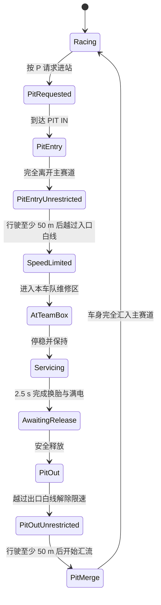

# 可复用维修区系统 · Pit Lane System

本文档说明 Mini Grand Prix 当前维修区的视觉样式、几何接口、比赛规则和接入流程。目标是让同一套维修区可以复用到新赛道，且玩家、AI、Canvas 渲染和规则判定始终使用同一份几何数据。

当前标准样式以上海大奖赛维修区为基准。

新地图的完整赛道尺寸、几何净距和导入闸门以 [`docs/track-authoring-standard.md`](../track-authoring-standard.md) 为准。上海与拉斯维加斯可作为既有实现参考，但新地图的 PIT IN/PIT OUT 必须使用摩纳哥已经实现的两端至少 `50 m` 非限速过渡段，不能复制旧赛道的较短连接距离。

## 1. 最终效果

维修区由三段连续道路组成：

1. `PIT IN`：从主赛道分流进入维修区。
2. 维修区主体：包含快速通道、工作通道和六支车队的 P 房。
3. `PIT OUT`：离开维修区并重新汇入主赛道。

核心原则：

- 进出口、维修区主体的道路粗细保持一致，上海站半宽为 `62` 世界单位。
- 路面统一为灰色，外轮廓和封闭侧边使用黑色实线。
- 上海的主赛道连接段绘制白色虚线；摩纳哥、比利时、阿布扎比、拉斯维加斯、阿塞拜疆与沙特阿拉伯的前后连接段保持黑色实线。
- 不使用红色线条装饰维修区道路或出口边界。
- 首个 P 房前 `30 m` 绘制入口白色实线并开始自动限速。
- 最后一个 P 房后 `30 m` 绘制出口白色实线并解除自动限速。
- 完全离开主赛道后至少行驶 `50 m` 才能到入口限速白线。
- 越过出口限速白线后至少行驶 `50 m` 才能开始汇入主赛道。
- 白线位置按真实赛道长度换算和沿维修区中心线插值，不按固定采样点粗略放置。

## 2. 视觉规范

| 元素 | 样式 | 作用 |
|:---|:---|:---|
| 维修区路面 | `#858792` 灰色 | 与主赛道路面区分 |
| 道路外轮廓 | `#30323a` 深色 | 形成黑色实体边界 |
| 快速/工作通道分隔线 | `#f5d76e` 黄色虚线 | 区分两条维修区车道 |
| 主赛道连接段 | 上海：白色虚线 `[14, 10]`；其余六站：黑色实线 | 赛道专属的进出站边界外观 |
| 30 m 限速线 | 白色实线，宽度 `5` | 控制限速开始和结束 |
| PIT IN 标牌 | 红底；黑色实线样式赛道隐藏 | 标识入口，不参与道路边界装饰 |
| PIT OUT 标牌 | 蓝底；黑色实线样式赛道隐藏 | 标识出口，不参与道路边界装饰 |
| P 房停车框 | 车队色 + 白色描边 | 标识各车队可换胎区域 |

入口与出口连接段之外，靠近主赛道的一侧必须继续保持黑色实线，防止玩家从任意位置横穿进入维修区。

摩纳哥、比利时、阿布扎比、拉斯维加斯、阿塞拜疆与沙特阿拉伯采用黑色实线入口和出口，不绘制 `PIT IN` / `PIT OUT` 文字标牌。该差异只影响 Canvas 外观；请求进站、合法过渡区、自动限速、P 房服务和安全释放规则仍与上海一致。

## 3. 规则

### 3.1 请求进站

- 玩家按 `P` 请求或取消进站。
- 请求后，入口连接段被视为合法的 PIT IN 过渡区。
- 赛车沿 PIT IN 离开主赛道时，不累计“赛道界限”。
- 未请求进站时，不应把普通驶离赛道误认为合法进站。

### 3.2 自动限速

- 限速入口位于首个 P 房中心点前 `30 m`。
- 限速出口位于最后一个 P 房中心点后 `30 m`。
- 两条白色实线之间，`pitSpeedLimited` 为 `true`。
- 当前内部速度上限为 `115`，HUD 按自身比例显示 km/h。
- 限速由系统自动执行，不设置“维修区超速”罚时玩法。
- 玩家与 AI 必须读取同一个 `getPitSpeedLimitRange(track)` 结果。

### 3.3 赛道界限

赛道界限和维修区限速是两个独立状态：

| 阶段 | 自动限速 | 赛道界限 |
|:---|:---:|:---:|
| PIT IN 合法连接段 | 视白线位置而定 | 暂停 |
| 完全离开主道后的 50 m 过渡段 | 关闭 | 暂停 |
| 两条 30 m 白线之间 | 开启 | 暂停 |
| 越过出口白线、仍在 PIT OUT | 关闭 | 继续暂停 |
| 车身完全汇入主赛道 | 关闭 | 恢复 |

出口白线只负责解除自动限速，不能同时恢复赛道界限。车辆从 P 房安全释放后会设置 `_pitExitActive`；只有车辆越过 PIT OUT 末端并且车身回到主赛道路面内，该标记才会清除并恢复普通赛道界限。

### 3.4 P 房与换胎

- 六支车队各有一个固定 P 房中心点。
- 上海站单个车队维修区长度为 `276` 世界单位。
- 赛车处于自己车队的完整维修区范围内均可换胎，不要求停在单一像素点。
- 横向容差为 `22` 世界单位。
- 速度低于内部值 `24` 且连续停稳 `2.5 s` 后完成换胎。
- 离开允许范围、速度过高或停车中断都会重置换胎计时。
- 同配方换新胎也算完成正赛强制换胎。

换胎完成时：

- 更换为预选轮胎或系统建议轮胎。
- 轮胎磨损归零、圈数归零、温度设为 `72°C`。
- 车辆损伤降至原值的 `35%`。
- ERS 电池恢复至 `100%`。
- 设置 `_pitServiced`、`_pitExitActive` 和 `awaitingRelease`。
- HUD 引导切换为 `PIT OUT`，不再显示“前往 P 房”。

### 3.5 安全释放

- 换胎后检查 PIT OUT 附近 `260` 世界单位内的高速来车。
- 有来车时显示“等待放行”。
- 安全时显示“安全释放 · PIT OUT”。
- 安全释放开始后，车辆仍属于合法 PIT OUT 状态，不报告赛道界限。
- 弯曲出口路线需要保留采样容差，不能误判为草地或缓冲区，否则会错误限制加速。

## 4. 状态流转



关键车辆字段：

| 字段 | 含义 | 清除时机 |
|:---|:---|:---|
| `_pitRequested` | 已请求进站 | 完成换胎 |
| `isPitLane` | 当前处于维修区道路 | 离开维修区几何范围 |
| `pitSpeedLimited` | 当前位于两条限速白线之间 | 越过出口白线 |
| `atPitBox` | 位于本车队完整维修区内 | 离开车队区域 |
| `_pitServiced` | 本次进站已完成换胎 | 离开维修区后 |
| `awaitingRelease` | 正在等待安全释放 | 驶离维修区主体 |
| `_pitExitActive` | 合法 PIT OUT 保护中 | 完全汇入主赛道 |

## 5. 代码职责

| 文件 | 职责 |
|:---|:---|
| `src/game/track.js` | 维修区配置、路线、车道宽度、P 房位置、30 m 白线和最近点查询 |
| `src/renderer/track-render.js` | 灰色道路、黑色边界、连接虚线、限速实线、停车框和标牌 |
| `src/game/car.js` | 路面识别、自动限速标志、PIT IN/PIT OUT 合法道路捕获和汇流完成判定 |
| `src/game/race-systems.js` | 赛道界限豁免、换胎、满电、安全释放和比赛处罚 |
| `src/game/ai.js` | AI 进站决策、维修区寻路、停车、限速和出站 |
| `src/renderer/hud.js` | P 房/PIT OUT 引导、释放提示、轮胎和电池状态 |
| `tests/run.js` | 规则、几何和 AI 完赛回归测试 |

## 6. 几何 API

### `getPitConfig(track)`

返回赛道的维修区采样范围：

```js
{
  entryStart,
  entryEnd,
  exitStart,
  exitEnd,
  entryGateStart,
  entryGateEnd,
  exitGateStart,
  exitGateEnd
}
```

- `entryStart..entryEnd`：入口道路渐变或连接范围。
- `exitStart..exitEnd`：出口道路汇流范围。
- `entryGateStart..entryGateEnd`：允许穿越并绘制白色虚线的入口连接段。
- `exitGateStart..exitGateEnd`：允许穿越并绘制白色虚线的出口连接段。

### `getPitRoutePoint(track, k, lane)`

返回指定采样位置和车道的世界坐标、切线和法线。`lane` 为：

- `fast`：靠近主赛道的快速通道。
- `work`：靠近 P 房的工作通道。

渲染、玩家识别和 AI 寻路必须使用此函数，不能分别维护三套坐标。

### `getPitRoadHalfWidth(k, track)`

返回道路半宽。上海站始终返回 `62`，因此入口、主体和出口粗细不变；其他赛道可以使用平滑渐变，但端点必须保留可驾驶宽度。

### `getPitBox(track, teamOrIndex)`

返回车队 P 房的 `k`、坐标和朝向。P 房应放在 `work` 通道一侧，并且各车队区域不能重叠。

### `getPitSpeedLimitRange(track)`

从首个和最后一个 P 房沿维修区中心线分别测量 `30 m`，返回：

```js
{
  entryK,
  exitK,
  entryLine,
  exitLine,
  entryDistance,
  exitDistance,
  targetDistance
}
```

`entryLine` 和 `exitLine` 是精确插值后的坐标与法线，Canvas 应直接使用它们绘制白线。

## 7. 复用到新赛道

### 第一步：定义入口和出口

在 `src/game/track.js` 添加新赛道的配置，并在 `getPitConfig()` 中路由：

```js
const NEW_TRACK_PIT_CONFIG = {
  entryStart: -200,
  entryEnd: -150,
  exitStart: 60,
  exitEnd: 110,
  entryGateStart: -185,
  entryGateEnd: -150,
  exitGateStart: 60,
  exitGateEnd: 95
};
```

这些数字只展示字段关系，不是可复制的固定采样值。必须沿新赛道自己的维修区中心线换算米制距离。入口和出口的切线方向必须与相邻主赛道同向，不能反向或形成锐角。

### 第二步：实现路线

在 `getPitRoutePoint()` 中选择一种方式：

- 平行路线：基于主赛道采样点的法线偏移，适合上海。
- 贝塞尔路线：入口、出口不平行时使用，适合拉斯维加斯。

无论哪种方式，都必须返回连续的 `x/y`、`tx/ty`、`nx/ny`、`k` 和 `amount`。

### 第三步：放置六个 P 房

为新赛道定义六个按行驶方向递增的 `k`：

```js
const boxKs = [-60, -48, -36, -24, -12, 0];
const p = getPitRoutePoint(track, boxKs[index], 'work');
```

确认：

- 首个 P 房前至少能容纳 30 m 限速入口线。
- 最后一个 P 房后至少能容纳 30 m 限速出口线。
- 入口汇出结束到入口白线之间至少保留 50 m 非限速道路。
- 出口白线到出口汇流开始之间至少保留 50 m 非限速道路。
- 六个 P 房互不重叠。
- P 房到 PIT OUT 之间没有多余道路突出地图。

### 第四步：启用合法连接段

如果新赛道需要和上海相同的赛道界限保护，扩展 `isPitEntryTransition()` 和 `isPitExitTransition()`，根据赛道侧别检查 lateral 正负方向。

不要把整段维修区都定义为连接段；只有入口和出口允许跨越黑色实体边界。

### 第五步：让 AI 使用路线

把新赛道 ID 加入 AI 的独立维修区路线列表，并根据采样间距设置合理的前瞻点。验证 AI 能：

- 只在 PIT IN 附近切入维修区。
- 沿快速通道驶向所属 P 房。
- 停进本车队区域并完成 2.5 秒换胎。
- 安全释放后沿 PIT OUT 汇回主赛道。
- 不在出口端点反复转向或卡住。

### 第六步：增加回归测试

至少覆盖：

1. 入口和出口坐标有限且路线连续。
2. 端点切线与主赛道同向。
3. 独立维修区与非汇流主赛道保持净距。
4. 六个 P 房唯一且互不重叠。
5. 白线位于首个 P 房前、最后一个 P 房后各精确 30 m，且白线与主赛道连接之间分别保留至少 50 m。
6. 白线之间自动限速但不产生超速罚时。
7. 完成换胎后轮胎更新且电池为 100%。
8. PIT IN 和 PIT OUT 不累计赛道界限。
9. 越过出口白线后解除限速，但完全汇入前仍不报越界。
10. 六支车队 AI 都能完成三圈并至少进站一次。

## 8. 不变量与常见错误

以下条件应始终成立：

- 道路中心、边界、AI 路线和车辆碰撞来自同一套路线函数。
- 限速白线和 `pitSpeedLimited` 来自同一个范围函数。
- 连接虚线只出现在 gate 范围，主体边界保持黑色实线。
- 出口白线不是赛道界限恢复线。
- `_pitExitActive` 只能在完全汇入主赛道后清除。
- P 房服务范围使用车队区域长度，而不是一个很小的停车点半径。
- 换胎奖励只在服务完成时触发，单纯驶入维修区不能换胎或补满电池。

常见错误：

| 现象 | 原因 | 修复方向 |
|:---|:---|:---|
| PIT OUT 一直报“赛道界限” | 越过出口白线时过早恢复边界判定 | 保持 `_pitExitActive` 到完全汇入 |
| 出站后无法加速 | 出口道路被识别为草地，或限速范围没有关闭 | 检查路线采样容差和 `exitK` |
| 白线与实际限速错位 | 渲染和物理分别计算位置 | 都使用 `getPitSpeedLimitRange()` |
| 一直显示“前往 P 房” | HUD 只判断 `_pitServiced`，未判断出口状态 | `_pitExitActive` 和 `awaitingRelease` 优先显示 PIT OUT |
| 车停在车队区域却不能换胎 | 服务范围仍使用小停车点 | 使用 `getPitBoxLength()/2` 和横向容差 |
| 入口/出口多出尖角 | 道路宽度在端点收为零或中心线不连续 | 保留端点宽度并检查相邻切线 |
| AI 在出口打转 | 出站后仍使用 P 房目标或进度索引未同步 | 到达出口后释放维修区寻路状态 |

## 9. 验证命令

```bash
node tests/run.js
git diff --check
```

涉及路线、白线、P 房或 HUD 布局时，还必须通过本地 HTTP 服务启动游戏，进入对应赛道进行 Canvas 冒烟测试：

```bash
python3 -m http.server 4173 --bind 127.0.0.1
```

验收时实际驾驶一遍完整流程：请求进站 → PIT IN 完全离开主道 → 至少 50 m 非限速段 → 入口白线 → 本车队 P 房换胎 → 电池 100% → 安全释放 → 出口白线解除限速 → 至少 50 m 非限速段 → 开始汇流 → 完全汇入主赛道并恢复赛道界限。
